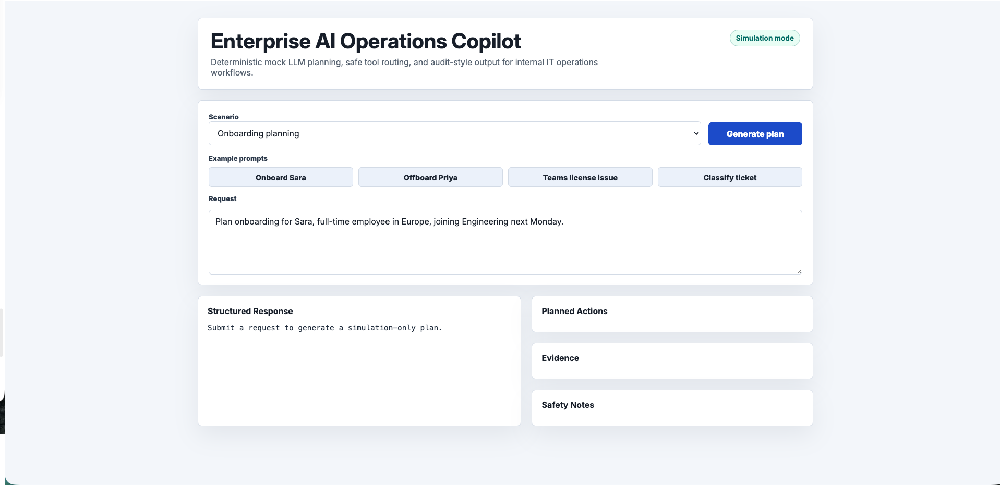
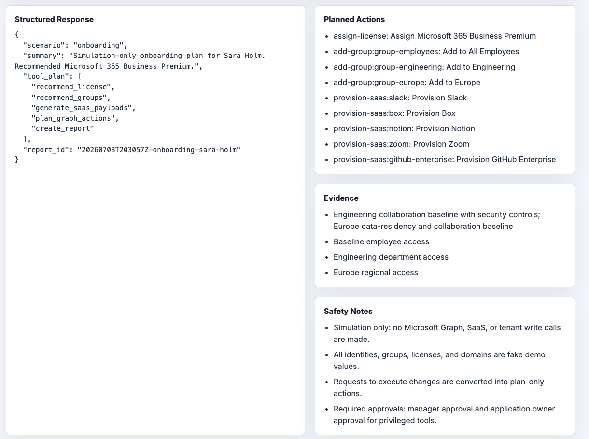
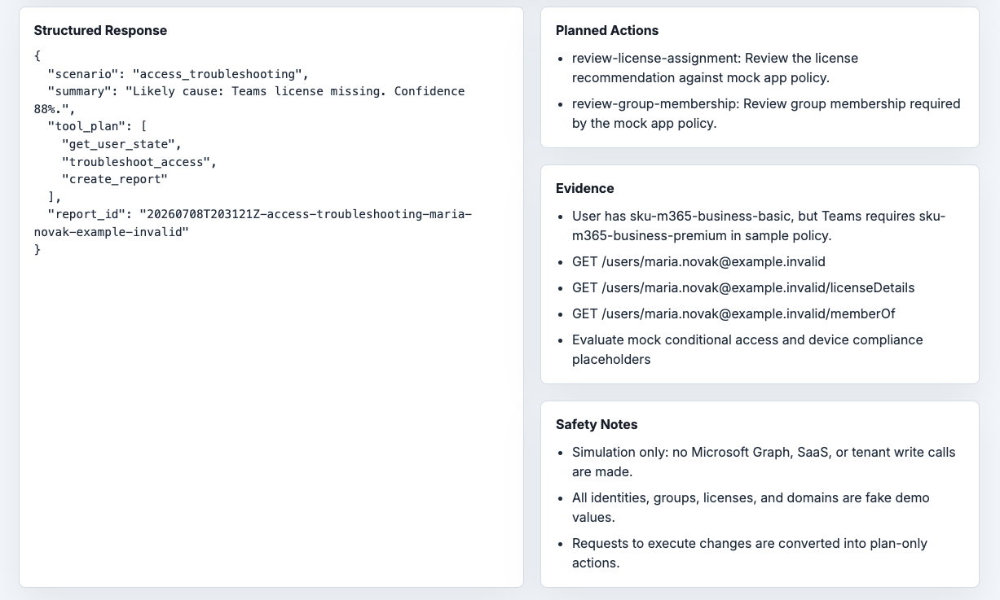
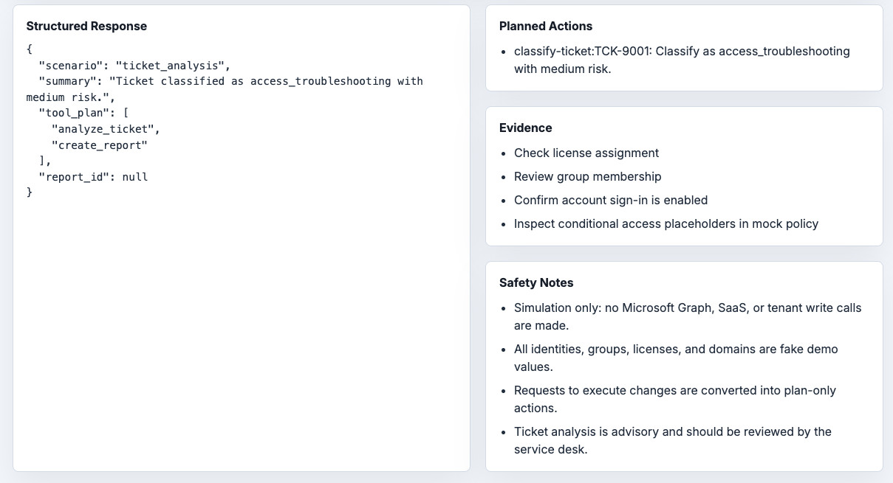
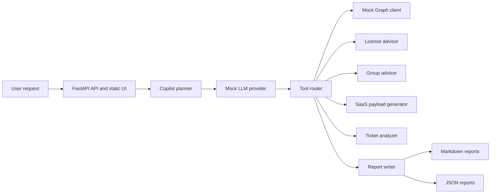

# Enterprise AI Operations Copilot

[](https://github.com/Waiivyy/Enterprise-AI-Operations-Copilot/actions/workflows/ci.yml)

A simulation-first AI operations copilot for enterprise IT teams. It demonstrates how LLM planning, tool calling, mock Microsoft Graph workflows, IT ticket analysis, and audit reporting can be combined to support safer onboarding, offboarding, and access troubleshooting.

This project demonstrates the architecture of an AI-assisted operations copilot. The default demo uses a deterministic mock LLM provider so the repository can run without paid APIs or secrets. It does not connect to a real Microsoft 365 tenant or require OpenAI, Azure, Microsoft Graph, Slack, Box, Zoom, Notion, or company credentials.

For local clone paths and examples, the recommended lowercase convention is `enterprise-ai-operations-copilot`.

## Why This Exists

Internal IT teams often need to turn incomplete support requests into structured plans: which license fits, which groups are required, which SaaS apps need provisioning, what approvals are missing, and what evidence should be documented for audit review. This lab models those workflows with strict simulation boundaries so planning, validation, and reporting patterns can be reviewed without touching production systems.

## Quick Demo

```bash
git clone https://github.com/Waiivyy/Enterprise-AI-Operations-Copilot.git enterprise-ai-operations-copilot
cd enterprise-ai-operations-copilot
python3.11 -m venv .venv
source .venv/bin/activate
python -m pip install -e ".[dev]"
uvicorn app.main:app --reload
```

Open `http://127.0.0.1:8000`, or call the API:

```bash
curl -s http://127.0.0.1:8000/chat \
  -H "Content-Type: application/json" \
  -d '{"scenario":"onboarding","message":"Plan onboarding for Sara, full-time employee in Europe, joining Engineering next Monday."}'
```

## Visual Proof

- [Architecture diagram](assets/architecture-diagram.md)
- [Architecture SVG](assets/architecture-diagram.svg)
- [Demo output examples](assets/demo-output.md)
- [Project summary](assets/project-summary.md)
- [Screenshot capture guide](docs/screenshots.md)
- Sample reports in `reports/`

Screenshots from the local demo:

| Homepage | Onboarding response |
| --- | --- |
|  |  |

| Access troubleshooting | Ticket analysis |
| --- | --- |
|  |  |

## Demo Scenarios

### 1. Onboarding Planning

Example prompt:

```text
Plan onboarding for Sara, full-time employee in Europe, joining Engineering next Monday.
```

What the copilot checks:

- Department and region
- Microsoft 365 license recommendation
- Entra-style group recommendations
- SaaS provisioning payloads
- Approval and safety notes

Example output summary:

```text
Simulation-only onboarding plan for Sara Holm. Recommended Microsoft 365 Business Premium.
```

### 2. Offboarding Planning

Example prompt:

```text
Create an offboarding checklist for Priya leaving on Friday.
```

What the copilot checks:

- Sign-in disablement planning
- Session revocation planning
- License and group removal planning
- Manager handoff checklist
- SaaS deprovisioning payloads

Example output summary:

```text
Simulation-only offboarding plan for Priya Shah.
```

### 3. Microsoft Teams Access Troubleshooting

Example prompt:

```text
Maria cannot access Teams.
```

What the copilot checks:

- Mock tenant account status
- Teams license requirement
- Required group membership
- Device compliance placeholder
- Conditional access placeholder

Example output summary:

```text
Likely cause: Teams license missing. Confidence 88%.
```

### 4. Ticket Classification

Example prompt:

```text
Analyze this ticket: Maria can sign in but Teams says the license is missing.
```

What the copilot checks:

- Category
- Urgency
- Likely system
- Risk level
- Required approvals
- Automation candidacy

Example output summary:

```text
Ticket classified as access_troubleshooting with medium risk.
```

## Architecture



Simulation boundary:

- No live Microsoft Graph calls.
- No live SaaS calls.
- No real tenant IDs, secrets, production endpoints, or company domains.
- All demo emails use `example.invalid`.
- Destructive actions are converted to simulation-only planned actions.

## Features

- Natural-language `/chat` endpoint for onboarding, offboarding, access troubleshooting, and ticket analysis.
- Deterministic mock LLM provider that creates structured tool plans without API keys.
- Mock Microsoft Graph-style tenant state and action planning.
- License, group, and SaaS provisioning recommendation modules.
- IT ticket classification with urgency, system, approval, risk, and automation-candidate fields.
- Markdown and JSON report generation under `reports/`.
- Minimal static UI served by FastAPI.
- SQLite seed store for local demo data, plus readable JSON fixtures.
- Safety guardrails that convert execution requests into plan-only actions.

## Tech Stack

- Python 3.11+
- FastAPI
- Pydantic
- SQLite
- Mock LLM provider by default
- Optional OpenAI-compatible provider interface, disabled by default
- Markdown and JSON reports
- Docker and Docker Compose
- GitHub Actions CI
- Pytest unit tests

## API Examples

Health:

```bash
curl -s http://127.0.0.1:8000/health
```

List sample tickets:

```bash
curl -s http://127.0.0.1:8000/tickets
```

Analyze access:

```bash
curl -s http://127.0.0.1:8000/workflows/troubleshoot-access \
  -H "Content-Type: application/json" \
  -d '{"user_email":"maria.novak@example.invalid","app_name":"Teams","issue":"Maria cannot access Teams."}'
```

Plan offboarding:

```bash
curl -s http://127.0.0.1:8000/workflows/offboarding \
  -H "Content-Type: application/json" \
  -d '{"user":{"display_name":"Priya Shah","email":"priya.shah@example.invalid","department":"Finance","region":"North America","employment_type":"full-time"},"preserve_mailbox_access_for":"Elena Cruz"}'
```

## Safety Model

This project is simulation-first by design:

- No real Microsoft Graph calls.
- No real tenant IDs, secrets, employees, or production domains.
- No live SaaS provisioning or deprovisioning.
- All demo emails use `example.invalid`.
- All group IDs and license SKUs are readable fake values.
- Any action labeled `execute` is converted to `plan`.
- Reports are audit-style planning artifacts, not execution logs.

More detail is in [docs/safety-model.md](docs/safety-model.md).

## Run Locally

```bash
python3.11 -m venv .venv
source .venv/bin/activate
python -m pip install -e ".[dev]"
uvicorn app.main:app --reload
```

Run tests:

```bash
pytest
```

Run the browser-level UI smoke test:

```bash
python -m pip install -e ".[dev,e2e]"
python -m playwright install chromium
pytest -m e2e
```

The browser test starts the FastAPI app on an available local port, submits the Teams access-troubleshooting example in Chromium, and verifies the structured response, planned actions, evidence, and safety notes.

## Run With Docker

```bash
docker compose up --build
```

The app will be available at `http://127.0.0.1:8000`.

## What It Does Not Claim

- It is not production-ready automation.
- It does not perform advanced real LLM reasoning in default mode.
- It does not execute tenant changes.
- It does not replace human approval, IT governance, HR confirmation, or service-owner review.
- It does not include real credentials, real tenant data, or real employee information.

## Roadmap

- Add richer SQLite-backed workflow history.
- Add policy simulation for license and app assignment rules.
- Add approval-chain modeling.
- Add optional OpenAI-compatible provider implementation behind explicit configuration.
- Add richer report templates and redaction checks.

## Contributing and Security

See [CONTRIBUTING.md](CONTRIBUTING.md) for local development and pull request expectations. Report security concerns using the process in [SECURITY.md](SECURITY.md); never include real credentials, tenant details, or employee data.

## License

MIT
