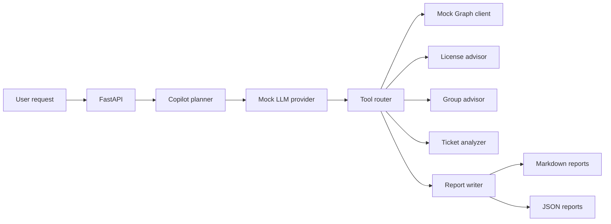

# Enterprise AI Operations Copilot

A simulation-first AI operations copilot for enterprise IT teams. It demonstrates how LLM planning, tool calling, mock Microsoft Graph workflows, IT ticket analysis, and audit reporting can be combined to support safer onboarding, offboarding, and access troubleshooting.

The default demo is public-safe: it uses mock data, fake users, fake groups, fake license IDs, `example.invalid` email addresses, and a deterministic mock LLM provider. It does not connect to a real Microsoft 365 tenant or require OpenAI, Azure, Microsoft Graph, Slack, Box, Zoom, Notion, or company credentials.

## Why This Exists

Internal IT teams often need to turn incomplete support requests into structured plans: which license fits, which groups are required, which SaaS apps need provisioning, what approvals are missing, and what evidence should be documented for audit review. This lab models those workflows with strict simulation boundaries so the planning, validation, and reporting design can be studied without touching production systems.

## Quick Demo

```bash
python3.11 -m venv .venv
source .venv/bin/activate
python -m pip install -e ".[dev]"
uvicorn app.main:app --reload
```

Open `http://127.0.0.1:8000`, or call the API:

```bash
curl -s http://127.0.0.1:8000/chat \
  -H "Content-Type: application/json" \
  -d '{"scenario":"onboarding","message":"Plan onboarding for Sara, full-time employee in Europe, joining Engineering next Monday."}'
```

## Demo Output

See [assets/demo-output.md](assets/demo-output.md) for sample responses and planned actions.

## Architecture



## Features

- Natural-language `/chat` endpoint for onboarding, offboarding, access troubleshooting, and ticket analysis.
- Deterministic mock LLM provider that creates structured tool plans without API keys.
- Mock Microsoft Graph-style tenant state and action planning.
- License, group, and SaaS provisioning recommendation modules.
- IT ticket classification with urgency, system, approval, risk, and automation-candidate fields.
- Markdown and JSON report generation under `reports/`.
- Minimal static UI served by FastAPI.
- SQLite seed store for local demo data, plus readable JSON fixtures.
- Safety guardrails that convert execution requests into plan-only actions.

## Tech Stack

- Python 3.11+
- FastAPI
- Pydantic
- SQLite
- Mock LLM provider by default
- Optional OpenAI-compatible provider interface, disabled by default
- Markdown and JSON reports
- Docker and Docker Compose
- GitHub Actions CI
- Pytest unit tests

## API Examples

Health:

```bash
curl -s http://127.0.0.1:8000/health
```

List sample tickets:

```bash
curl -s http://127.0.0.1:8000/tickets
```

Analyze access:

```bash
curl -s http://127.0.0.1:8000/workflows/troubleshoot-access \
  -H "Content-Type: application/json" \
  -d '{"user_email":"maria.novak@example.invalid","app_name":"Teams","issue":"Maria cannot access Teams."}'
```

Plan offboarding:

```bash
curl -s http://127.0.0.1:8000/workflows/offboarding \
  -H "Content-Type: application/json" \
  -d '{"user":{"display_name":"Priya Shah","email":"priya.shah@example.invalid","department":"Finance","region":"North America","employment_type":"full-time"},"preserve_mailbox_access_for":"Elena Cruz"}'
```

## Safety Model

This project is simulation-first by design:

- No real Microsoft Graph calls.
- No real tenant IDs, secrets, employees, or production domains.
- No live SaaS provisioning or deprovisioning.
- All demo emails use `example.invalid`.
- All group IDs and license SKUs are readable fake values.
- Any action labeled `execute` is converted to `plan`.
- Reports are audit-style planning artifacts, not execution logs.

More detail is in [docs/safety-model.md](docs/safety-model.md).

## Run Locally

```bash
python3.11 -m venv .venv
source .venv/bin/activate
python -m pip install -e ".[dev]"
uvicorn app.main:app --reload
```

Run tests:

```bash
pytest
```

## Run With Docker

```bash
docker compose up --build
```

The app will be available at `http://127.0.0.1:8000`.

## Example Workflows

- "Plan onboarding for Sara, full-time employee in Europe, joining Engineering next Monday."
- "Create an offboarding checklist for Priya leaving on Friday."
- "Maria cannot access Teams."
- "Analyze this ticket: Maria can sign in but Teams says the license is missing."

## What It Does Not Claim

- It is not production-ready automation.
- It does not execute tenant changes.
- It does not replace human approval, IT governance, HR confirmation, or service-owner review.
- It does not include real credentials, real tenant data, or real employee information.

## Roadmap

- Add richer SQLite-backed workflow history.
- Add policy simulation for license and access rules.
- Add approval-chain modeling.
- Add optional OpenAI-compatible provider implementation behind explicit configuration.
- Add richer report templates and redaction checks.

## License

MIT
