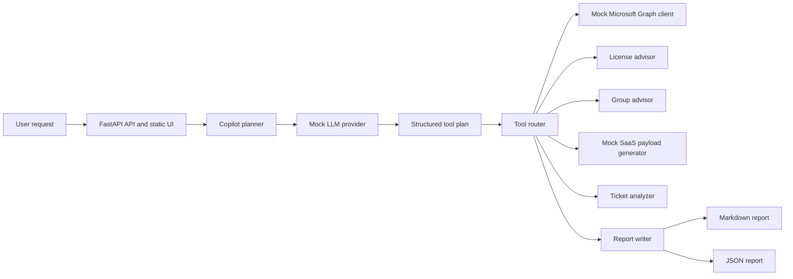

# Architecture Diagram

```mermaid
flowchart LR
  request[User request] --> fastapi[FastAPI API and static UI]
  fastapi --> planner[Copilot planner]
  planner --> mockllm[Mock LLM provider]
  mockllm --> plan[Structured tool plan]
  plan --> router[Tool router]
  router --> graphMock[Mock Microsoft Graph client]
  router --> licenseAdvisor[License advisor]
  router --> groupAdvisor[Group advisor]
  router --> saasPayloads[Mock SaaS payload generator]
  router --> ticketAnalyzer[Ticket analyzer]
  router --> reportWriter[Report writer]
  reportWriter --> markdownReport[Markdown report]
  reportWriter --> jsonReport[JSON report]
```
